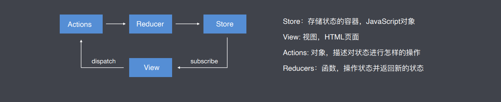
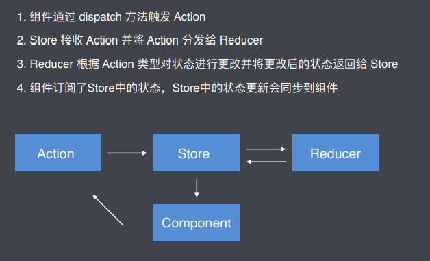
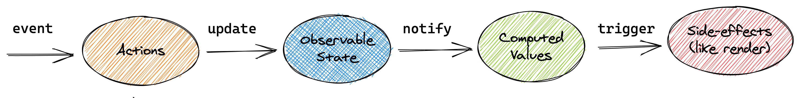

# 模块三：React 数据流方案专题（Redux、MobX）笔记  

## 任务一：Redux

### 1. 概念

 Redux是一种JavaScript 状态容器，提供可预测化的状态管理

### 2. Redux 核心概念

Store: 存储状态的容器，JavaScript 对象
View: 视图，HTML页面
Actions: 对象，描述对状态进行怎样的操作
Reducers: 函数，操作状态并返回新的状态



### 3. 在React中使用Redux

在 React 中组件通信的数据流是单向的，顶层组件可以通过 Props 属性向下层组件传递数据，而下层组件不能向上层组件传递数据。要实现下层组件修改数据，需要上层组件传递修改数据的方法到下层组件。等项目越来越大的时候，组件间传递数据变得越来越困难。

使用 Redux 管理数据，由于 Store 独立于组件，使得数据管理独立于组件，解决了组件与组件之间传递数据困难的问题。

### 4. Redux工作流程

1. 组件通过 dispatch 方法触发 Action
2. Store 接受 Action 并将 Action 分发给Reducer
3. Reducer 根据 Action 类型对状态进行更改并将更改后的状态返回给 Store
4. 组件订阅了 Store 中的状态， Store 中的状态更新会同步到组件



### 5. Redux中间件

中间价允许我们扩展和增强 redux 应用程序

开发中间件的模板

```js
export default store => next => action => {  }
```

**如果中间件中的结尾不调用`next(action)`，则整个流程就会卡在此处不会再往后执行了**

我们可以在Redux的createStore方法中通过applyMiddleware引入中间件

```js
import { createStore, applyMiddleware } from 'redux'
//中间件
import logger from './middlewares/logger' 

createStore(reducer, applyMiddleware( logger ))
```

## 任务二：Mobx6

### 1. 概念

MobX 是一个简单的可扩展的状态管理库，无样板代码风格简约。

### 2. Mobx核心概念

1. observable：被 MobX 跟踪的状态。
2. action：允许修改状态的方法，在严格模式下只有 action 方法被允许修改状态。
3. computed：根据现有状态衍生出来的状态。
4. flow：执行副作用，它是 generator 函数。可以更改状态值。



### 3. Mobx使用

1. 创建存储状态的 Store，同时创建修改状态的方法

```js
export default class CounterStore {
  constructor() {
    this.count = 0
  }
  increment() {
    this.count += 1
  }
  decrement() {
    this.count -= 1
  }
}
```

2. 让 MobX 可以追踪状态的变化

   (1) 通过 observable 标识状态，使状态可观察

   (2) 通过 action 标识修改状态的方法，状态只有通过 action 方法修改后才会通知视图更新

```js
import { action, makeObservable, observable } from "mobx"

export default class CounterStore {
  constructor() {
    this.count = 0
    makeObservable(this, {
      count: observable,
      increment: action,
      decrement: action
    })
  }
  increment() {
    this.count += 1
  }
  decrement() {
    this.count -= 1
  }
}
```

3. 创建 Store 类的实例对象并将实例对象传递给组件

```js
// App.js
import Counter from "./Counter"
import CounterStore from "../store/Counter"

const counterStore = new CounterStore()

function App() {
  return <Counter counterStore={counterStore} />
}

export default App
```

4. 在组件中通过 Store 实例对象获取状态以及操作状态的方法

```js
function Counter({ counterStore }) {
  return (
    <Container>
      <Button onClick={() => counterStore.increment()}>
        INCREMENT
      </Button>
      <Button>{counterStore.count}</Button>
      <Button onClick={() => counterStore.decrement()}>
        DECREMENT
      </Button>
    </Container>
  )
}

export default Counter
```

5. 当组件中使用到的 MobX 管理的状态发生变化后，使视图更新。通过 observer 方法包裹组件实现目的

```react
import { observer } from "mobx-react-lite"

function Counter() { }

export default observer(Counter)
```

6. 简化组件代码

```react
function Counter({ counterStore }) {
  const { count, increment, decrement } = counterStore
  return (
    <Container>
      <Button border="left" onClick={increment}>
        INCREMENT
      </Button>
      <Button>{count}</Button>
      <Button border="right" onClick={decrement}>
        DECREMENT
      </Button>
    </Container>
  )
}
```

7. 当代码简化后，修改状态的方法中的 this 指向出现了问题，通过 action.bound 强制绑定 this，使 this 指向 Store 实例对象

```react
import { action, makeObservable, observable } from "mobx"

export default class CounterStore {
  constructor() {
    this.count = 0
    makeObservable(this, {
      count: observable,
      increment: action.bound,
      decrement: action.bound
    })
  }
  increment() {
    this.count += 1
  }
  decrement() {
    this.count -= 1
  }
}
```

8. 总结：状态变化更新视图的必要条件

1. 状态必须被标记为 `observable`
2. 更改状态的方法必须被标记为 `action`
3. 组件必须通过 `observer` 方法包裹
