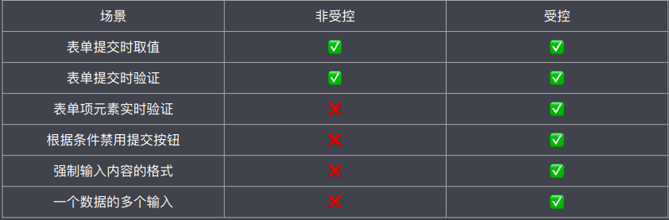

# 模块四：React Hooks、Chakra-UI、组件性能优化、封装组件库笔记  

## 任务一：Hooks

### 1. 概念

​	Hooks是用来对函数型组件进⾏增强, 让函数型组件可以存储状态, 可以拥有处理副作⽤的能⼒.  让开发者在不使⽤类组件的情况下, 实现相同的功能.

### 2. 类组件的不足(Hooks 要解决的问题)

（1）缺少逻辑复⽤机制

​	为了复⽤逻辑增加⽆实际渲染效果的组件，增加了组件层级 显示⼗分臃肿 增加了调试的难度以及运⾏效率的降低.

（2）类组件经常会变得很复杂难以维护

​	将⼀组相⼲的业务逻辑拆分到了多个⽣命周期函数中 在⼀个⽣命周期函数内存在多个不相⼲的业务逻辑

（3）类成员⽅法不能保证this指向的正确性

### 3. 总结

​	Hooks 意为钩⼦, React Hooks 就是⼀堆钩⼦函数, React 通过这些钩⼦函数对函数型组件进⾏增强, 不同的钩⼦函数提供了不同的功能.

## 任务二：Formik

### 1. Formik 介绍

增强表单处理能⼒. 简化表单处理流程. [官⽹](https://jaredpalmer.com/formik/)

### 2. Formik 基本使⽤

使⽤ formik 进⾏表单数据绑定以及表单提交处理

```js
import { useFormik } from 'formik'

function App () {
  const formik = useFormik({initialValues: {username: '张三'}, onSubmit: values => {}})
  return (
    <form onSubmit={formik.handleSubmit}>
  		<input type="text" name="username" value={formik.values.username} onChange=					{formik.handleChange} />
  		<input type="submit" />
  </form>
	)
}
```

### 3. 表单验证

（1）初始验证方式

```js
const formik = useFormik({
  validate: values => {
    const errors = {}
    if (!values.username) errors.username = '请输入用户名'
    return errors
  }
})

return <form>{formik.errors.username ? <div>{formik.errors.username}</div> : null}</form>
```

（2）表单验证（二）

```js
<input
  type="text"
  name="username"
  value={formik.values.username}
  onChange={formik.handleChange}
  onBlur={formik.handlerBlur}
/>
<p>{formik.touched.username && formik.errors.username ? formik.errors.username : null</p>
```

## 任务三：Component

表单数据交由DOM节点管理. 特点是表单数据在需要时进⾏获取. 代码实现相对简单

### 1. 受控组件

表单数据交由state对象管理. 特点是可以实时得到表单数据. 代码相对复杂

### 2. 选用标准

总结: 受控组件和⾮受控组件都有其特点, 应该根据需求场进⾏选择. 在⼤多数情况下, 推荐使⽤受控组件处理表单数据.  如果表单在数据交互⽅⾯⽐简单, 使⽤⾮受控表单, 否则使⽤受控表单.



## 任务四：CSS-IN-JS

### 1. 为什么会有 CSS-IN-JS

​	CSS-IN-JS 是 WEB 项⽬中将 CSS 代码捆绑在 JavaScript 代码中的解决⽅案. 这种⽅案旨在解决 CSS 的局限性, 例如缺乏动态功能, 作⽤域和可移植性.

### 2. CSS-IN-JS 介绍

CSS-IN-JS ⽅案的优点： 

1. 让 CSS 代码拥有独⽴的作⽤域, 阻⽌ CSS 代码泄露到组件外部, 防⽌样式冲突.  
2. 让组件更具可移植性, 实现开箱即⽤, 轻松创建松耦合的应⽤程序  
3. 让组件更具可重⽤性, 只需编写⼀次即可, 可以在任何地⽅运⾏. 不仅可以在同⼀应⽤程序中重⽤ 组件, ⽽且可以在使 ⽤相同框架构建的其他应⽤程序中重⽤组件.  
4.  让样式具有动态功能, 可以将复杂的逻辑应⽤于样式规则, 如果要创建需要动态功能的复杂UI, 它是理想的解决⽅案

CSS-IN-JS ⽅案的缺点： 

1. 为项⽬增加了额外的复杂性.  
2. ⾃动⽣成的选择器⼤⼤降低了代码的可读性

### 3. Emotion 介绍

Emotion 是⼀个旨在使⽤ JavaScript 编写 CSS 样式的库

```js
const style=css`
    width:100px;
    height:100px;
    background:skyblue;
`
<div css={style}>App works...</div>
```

```js
const style = css({
    width:200,
    height:200,
    background:"red"
})
function App(){
    return <div css={style}>App works</div>
}
```

## 任务五：ChakraUI

### 1. Chakra-UI 介绍

​	Chakra UI 是⼀个简单的, 模块化的易于理解的 UI 组件库. 提供了丰富的构建 React 应⽤所需的UI组件. ⽂档: https://next.chakra-ui.com/docs/getting-started 

1. Chakra UI 内置 Emotion，是 CSS-IN-JS 解决⽅案的集⼤成者  
2. 基于 Styled-Systems https://styled-system.com/   
3. ⽀持开箱即⽤的主题功能  
4. 默认⽀持⽩天和⿊夜两种模式  
5. 拥有⼤量功能丰富且⾮常有⽤的组件  
6. 使响应式设计变得轻⽽易举  
7. ⽂档清晰⽽全⾯. 查找API更加容易  
8. 适⽤于构建⽤于展示的给⽤户的界⾯  
9. 框架正在变得越来越完善 

### 2. 引入主题

```js
import React from 'react';
import ReactDOM from 'react-dom';
import App from './App';
import theme from '@chakra-ui/theme'
import { ChakraProvider } from "@chakra-ui/react"

ReactDOM.render(
  <ChakraProvider theme={theme}>
    <App />
  </ChakraProvider>,
  document.getElementById('root')
);
```

### 3. 引⼊ CSS 重置组件

```js
import { CSSReset } from '@chakra-ui/core';

<ChakraProvider theme={theme}>
    <CSSReset/>
    <App/>
</ChakraProvider>    
```

