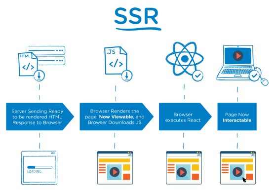
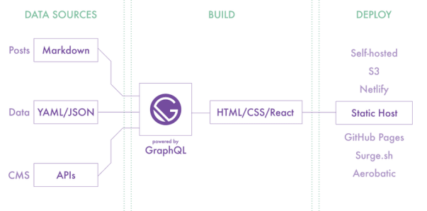

# 模块四：React 服务端渲染专题（原生实现、Next.js 集成框架、Gatsby）笔记  

## 任务一：ReactSSR

### 一.  概念

客户端渲染：服务器端仅返回 JSON 数据, DATA 和 HTML 在客户端进行渲染.

服务器端渲染：服务器端返回HTML, DATA 和 HTML 在服务器端进行渲染.

### 二. 为什么要使用服务端渲染

#### 客户端渲染存在的问题

1. 首屏等待时间长, 用户体验差 
2. 页面结构为空, 不利于 SEO

#### SPA 应用中服务器端渲染解决的问题



### 三. React SSR 介绍

#### React SSR 同构

同构指的是代码复用. 即实现客户端和服务器端最大程度的代码复用

#### 实现 React SSR

1. 引入要渲染的 React 组件 
2. 通过 renderToString 方法将 React 组件转换为 HTML 字符串 
3. 将结果HTML字符串想到到客户端 

renderToString 方法用于将 React 组件转换为 HTML 字符串, 通过 react-dom/server 导入

#### 项目启动命令配置

1. 配置服务器端打包命令: "dev:server-build": "webpack --config webpack.server.js --watch" 
2.  配置服务端启动命令: "dev:server-run": "nodemon --watch build --exec \"node build/bundle.js\""

#### 客户端 React 附加事件

**实现思路分析:**

在客户端对组件进行二次"渲染", 为组件元素附加事件.

**客户端二次 "渲染" hydrate**:

使用 hydrate 方法对组件进行渲染, 为组件元素附加事件. hydrate 方法在实现渲染的时候, 会复用原本已经存在的 DOM 节点, 减少重新生成节点以及删除原本 DOM 节点的开销. 通过 react-dom 导入 hydrate.

#### 路由支持

**实现思路分析:**

在 React SSR 项目中需要实现两端路由.  

客户端路由是用于支持用户通过点击链接的形式跳转页面.  

服务器端路由是用于支持用户直接从浏览器地址栏中访问页面. 

客户端和服务器端公用一套路由规则

#### Redux 支持

**实现思路分析:**

在实现了 React SSR 的项目中需要实现两端 Redux. 

客户端 Redux 就是通过客户端 JavaScript 管理 Store 中的数据. 

服务器端 Redux 就是在服务器端搭建一套 Redux 代码, 用于管理组件中的数据. 

客户端和服务器端共用一套 Reducer 代码. 

创建 Store 的代码由于参数传递不同所以不可以共用.

**服务器端 store 数据填充:**

问题：服务器端创建的 store 是空的, 组件并不能从Store中获取到任何数据. 

解决：服务器端在渲染组件之前获取到组件所需要的数据. 

1. 在组件中添加 loadData 方法, 此方法用于获取组件所需数据，方法被服务器端调用 
2. 将 loadData 方法保存在当前组件的路由信息对象中. 
3.  服务器端在接收到请求后，根据请求地址匹配出要渲染的组件的路由信息 
4. 从路由信息中获取组件中的 loadData 方法并调用方法获取组件所需数据 
5.  当数据获取完成以后再渲染组件并将结果响应到客户端

**React 警告消除**

警告原因: 客户端 Store 在初始状态下是没有数据的, 在渲染组件的时候生成的是空 ul, 但是服务器端是先获取数据再进行的组件渲染,  所以生成的是有子元素的ul, hydrate 方法在对比的时候发现两者不一致, 所以报了个警告. 解决思路: 将服务器端获取到的数据回填给客户端, 让客户端拥有初始数据

## 任务二：Next

### 一. 概念

Next.js 是 React 服务端渲染应用框架. 用于构建 SEO 友好的 SPA 应用. 

1. 支持两种预渲染方式, 静态生成和服务器端渲染. 
2. 基于页面的路由系统, 路由零配置 
3. 自动代码拆分. 优化页面加载速度. 
4. 支持静态导出, 可将应用导出为静态网站. 
5. 内置 CSS-in-JS 库 styled-jsx
6. 方案成熟, 可用于生产环境, 世界许多公司都在使用 
7. 应用部署简单, 拥有专属部署环境 Vercel, 也可以部署在其他环境

### 二. 创建 Next.js 项目

创建: npm init next-app next-guide 

运行: npm run dev 

访问: localhost:3000 


临时安装 create-next-app 用于创建 Next.js 项目.

### 三. 基于页面的路由系统

#### 创建页面 

在 Next.js 中, 页面是被放置在 pages 文件夹中的 React 组件.  

组件需要被默认导出. 组件文件中不需要引入 React. 

页面地址与文件地址是对应的关系

```js
export default function List () {
  return (
    <div>List Page</div>
  )
}
```

#### 页面跳转

Link 组件默认使用 JavaScript 进行页面跳转.即 SPA 形式的跳转.
如果浏览器中 JavaScript 被禁用.则使用链接跳转.
Link 组件中不应添加除 href 属性以外的属性，其余属性添加到 a 标签上.
Link 组件通过预取(在生产中)功能自动优化应用程序以获得最佳性能.

```js
import Link from 'next/link'

export default function Home() {
  return <div>
    Index Page works
    <Link href="/list"><a>Jump to List Page</a></Link>
  </div>
}
```

### 四. 静态资源、元数据和 CSS

#### 静态资源

应用程序根目录中的 public 文件夹用于提供静态资源.

通过以下形式进行访问.

public/images/1.jpg -> /images/1.jpg 

public/css/base.css -> /css/base.css

#### 修改页面元数据

通过 Head 组件修改元数据.

```js
import Head from 'next/head'

<>
  <Head>
    <title>next app</title>
  </Head>
</>
```

#### CSS 样式

**内置 styled-jsx**

在 Next.js 中内置了 styled-jsx, 它是一个 CSS-in-JS 库, 允许在 React 组件中编写 CSS, CSS 仅作用于组件内部. 

```js
export default function Home() {
  return <>
    <Head>
      <title>Index Page</title>
    </Head>
    <div>
      Index Page works
      <Link href="/list"><a className="demo">Jump to List Page</a></Link>
      
    </div>
    <style jsx>{`
      .demo {
        color: red
      }
    `}</style>
  </>
}
```

**CSS 模块**

通过使用 CSS 模块功能, 允许将组件的 CSS 样式编写在单独的 CSS 文件中. 

CSS 模块约定样式文件的名称必须为"组件文件名称.module.css"

```js
import Head from "next/head";
import style from './list.module.css'

export default function List () {
  return (
    <>
      <Head>
        <title>List Page</title>
      </Head>
      <div className={style.demo}>List Page</div>
    </>
  )
}
```

**全局样式文件**

1. 在 pages 文件夹中新建 _app.js 文件并加入如下代码 
2. 在项目根目录下创建 styles 文件夹, 并在其中创建 global.css 
3. 在 _app.js 中通过 import 引入 global.css. 
4. 重新启动开发服务器

```js
import '../styles/globals.css'

function MyApp({ Component, pageProps }) {
  return <Component {...pageProps} />
}

export default MyApp

```

### 五. 预渲染

#### 预渲染概述

预渲染是指数据和HTML的拼接在服务器端提前完成.  

预渲染可以使 SEO 更加友好. 

预渲染会带来更好的用户体验, 可以无需运行 JavaScript 即可查看应用程序UI.

#### 预渲染的两种形式

在 Next.js 中支持两种形式的预渲染: 静态生成和服务器端渲染. 

静态生成和服务器端渲染是生成 HTML 的时机不同. 

静态生成: 静态生成是在构建时生成 HTML. 以后的每个请求都共用构建时生成好的 HTML.

服务器端渲染: 服务器端渲染是在请求时生成 HTML. 每个请求都会重新生成 HTML.

#### 两种预渲染方式的选择

Next.js 允许开发者为每个页面选择不同的预渲染方式. 不同的预渲染方式拥有不同的特点. 应根据场景进行渲染.  但建议大多数页面建议使用静态生成. 

静态生成一次构建, 反复使用, 访问速度快. 因为页面都是事先生成好的. 

适用场景：营销页面、博客文章、电子商务产品列表、帮助和文档 

服务器端渲染访问速度不如静态生成快, 但是由于每次请求都会重新渲染, 所以适用数据频繁更新的页面或页面内容随请求变化而变 化的页面

#### 无数据和有数据的静态生成

如果组件不需要在其他地方获取数据, 直接进行静态生成.

如果组件需要在其他地方获取数据, 在构建时 Next.js 会预先获取组件需要的数据, 然后再对组件进行静态生成.

#### 静态生成 getStaticProps

getStaticProps 方法的作用是获取组件静态生成需要的数据. 

并通过 props 的方式将数据传递给组件. 该方法是一个异步函数, 需要在组件内部进行导出. 

在开发模式下, getStaticProps 改为在每个请求上运行.

```js
import Head from "next/head";
import style from './list.module.css'
import { readFile } from "fs";
import { promisify } from "util";
import { join } from "path";

const read = promisify(readFile)

export default function List ({data}) {
  return (
    <>
      <Head>
        <title>List Page</title>
      </Head>
      <div className={style.demo}>List Page</div>
      <div>{data}</div>
    </>
  )
}

export async function getStaticProps () {
  let data = await read(join(process.cwd(), 'pages', '_app.js'), 'utf-8')
  console.log(data) // 会在 node 环境下输出，这个函数会在构建时运行
  return {
    props: {
      data
    }
  }
}
```

#### 服务器端渲染 getServerSideProps

如果采用服务器端渲染, 需要在组件中导出 getServerSideProps 方法.

#### 基于动态路由的静态生成

基于参数为页面组件生成HTML页面，有多少参数就生成多少HTML页面 

在构建应用时, 先获取用户可以访问的所有路由参数, 再根据路由参数获取具体数据, 然后根据数据生成静态 HTML.

#### 实现基于动态路由的静态生成

1. 创建基于动态路由的页面组件文件, 命名时在文件名称外面加上[], 比如[id].js 
2. 导出异步函数 getStaticPaths, 用于获取所有用户可以访问的路由参数

```js
export async function getStaticPaths () {
  // 此处获取所有用户可以访问的路由参数
  return {
    // 返回固定合适的路由参数
    paths: [{params: {id: 1}}, {params: {id: 2}}],
    // 当用户访问的路由有参数没有在当前函数中返回时，是否显示 404 页面， false 表示显示， true 表示不显示
    fallback: false
  }
}
```

3. 导出异步函数 getStaticProps, 用于根据路由参数获取具体的数据

```js
export async function getStaticProps ({params}) {
  // params -> {id: 1}
  // 此处根据路由参数获取具体数据
  return {
    // 将数据传递到组件中进行静态页面的生成
    props: {}
  }
}
```

#### 自定义 404 页面

要创建自定义 404 页面，需要在 pages 文件夹中创建 404.js 文件

```js
export default function Error () {
  return <div>404 ~</div>
}
```

### 六. API Routes

#### 概念

API Routes 可以理解为接口, 客户端向服务器端发送请求获取数据的接口. 

Next.js 应用允许 React 开发者编写服务器端代码创建数据接口.

#### 实现 API Routes

1. 在 pages/api 文件夹中创建 API Routes 文件. 比如 user.js 
2. 在文件中默认导出请求处理函数, 函数有两个参数, req 为请求对象, res 为响应对象.

```js
export default function (req, res) {
  res.status(200).send({id: 1, name: 'TOM'})
}
```

3. 访问 API Routes： localhost:3000/api/user 不要在 getStaticPaths 或 getStaticProps 函数中访问 API Routes, 因为这两个函数就是在服务器端运行的, 可以直接写服务器端代码

## 任务三：Gatsby

### 一. Gatsby 介绍

Gatsby 是一个静态站点生成器. 

官网：https://www.gatsbyjs.org/

### 二. 静态应用的优势

1. 访问速度快 
2. 更利于 SEO 搜索引擎的内容抓取 
3. 部署简单

### 三. Gatsby 总览


1. 基于 React 和 GraphQL. 结合了 webpack, babel, react-router 等前端领域中最先进工具. 开发人员开发体验好 
2. 采用数据层和UI层分离而不失 SEO 的现代前端开发模式. 对SEO非常友好 
3. 数据预读取, 在浏览器空闲的时候预先读取链接对应的页面内容. 使静态页面拥有 SPA 应用的用户体验, 用户体验好 
4. 数据来源多样化: Headless CMS, markdown, API. 
5. 功能插件化, Gatsby 中提供了丰富且功能强大的各种类型的插件, 用什么装什么.

### 四. 创建 Gatsby 项目

1. 全局安装脚手架工具

​	npm install gatsby-cli -g

2. 创建项目

​	创建：gatsby new project-name https://github.com/gatsbyjs/gatsby-starter-hello-world 

​	启动：gatsby develop 或 npm start  

​	访问：localhost:8000

### 五. 基于文件的路由系统

Gatsby 框架内置基于文件的路由系统, 页面组件被放置在 src/pages 文件夹中.

### 六. 以编程的方式创建页面

基于同一个模板创建多个HTML页面，有多少数据就创建多少页面 

比如商品详情页面，有多少商品就生成多少商品详情展示页面.

```js
function createPages ({actions}) {
  const { createPage } = actions
  // 获取模板的绝对路径
  const template = require.resolve('./src/templates/person.js')
  // 获取模板所需要的数据
  const persons = [{slug: "zhangsan", name: '张三', age: 20}, {slug: 'lisi', name: '李四', age: 30}]
  // 根据模板和数据创建页面
  persons.forEach(person => {
    createPage({
      // 模板绝对路径
      component: template,
      // 访问地址
      path: `/person/${person.slug}`,
      // 传递给模板的数据
      context: person
    })
  })
}

module.exports = {
  createPages
}
```

### 七. Link 组件

在 Gatsby 框架中页面跳转通过 Link 组件实现.

```js
import React from "react"
import {Link} from 'gatsby'

export default function Home() {
  return <div>
    <Link to="/person/zhangsan">张三</Link>
    <Link to="/person/lisi">李四</Link>
  </div>
}
```

### 八. GraphQL 数据层

在 Gatsby 框架中提供了一个统一的存储数据的地方，叫做数据层. 

在应用构建时，Gatsby 会从外部获取数据并将数据放入数据层，组件可以直接从数据层查询数据. 

数据层使用 GraphQL 构建. 

调试工具：localhost:8000/___graphql



### 九. GraphQL 数据查询

#### 页面组件

在组件文件中导出查询命令, 框架执行查询并将结果传递给组件的 prop 对象. 存储在 props 对象的 data 属性中.

```js
import React from "react"
import {Link, graphql} from 'gatsby'

export default function Home({data}) {
  console.log(data)
  return <div>
    <p>{data.site.siteMetadata.title}</p>
    <p>{data.site.siteMetadata.auth}</p>
  </div>
}

export const query = graphql`
  query MyQuery {
    site {
      siteMetadata {
        title
        auth
      }
    }
  }
`
```

#### 非页面组件

通过钩子函数 useStaticQuery 进行手动查询.

```js
import React from 'react'
import { graphql, useStaticQuery } from "gatsby";
export default function Header() {
  const data = useStaticQuery(graphql`
    query NonPageQuery {
      site {
        siteMetadata {
          title
          auth
        }
      }
    }
  `)
  return (
    <div>
      <p>{data.site.siteMetadata.title}</p>
      <p>{data.site.siteMetadata.auth}</p>
    </div>
  )
}
```

### 十. Gatsby 插件

Gatsby 框架内置插件系统, 插件是为应用添加功能的最好的方式.

在 Gatsby 中有三种类型的插件: 分别为数据源插件 ( source ), 数据转换插件 ( transformer ), 功能插件 ( plugin ) 

数据源插件：负责从应用外部获取数据，将数据统一放在 Gatsby 的数据层中 

数据转换插件：负责转换特定类型的数据的格式，比如将 markdown 文件中的内容转换为对象形式 

功能插件：为应用提供功能，比如通过插件让应用支持 Less 或者 TypeScript.

### 十一. 将 JSON 数据放入数据层

要将本地 JSON 文件中的数据放入数据层需要用到两个插件. 

gatsby-source-filesystem: 用于将本地文件中的数据添加至数据层. 

gatsby-transformer-json：将原始JSON字符串转换为JavaScript对象.

```js
module.exports = {
  siteMetadata: {
    title: 'hello gatsby',
    auth: 'Cathy'
  },
  /* Your site config here */
  plugins: [
    {
      resolve: 'gatsby-source-filesystem',
      options: {
        name: 'json',
        path: `${__dirname}/json/`
      }
    },
    'gatsby-transformer-json'
  ],
}
```

### 十二. 图像优化

1. 图像文件和数据文件不在源代码中的同一位置 
2. 图像路径基于构建站点的绝对路径, 而不是相对于数据的路径, 难以分析出图片的真实位置 
3. 图像没有经过任何优化操作

gatsby-source-filesystem: 用于将本地文件信息添加至数据层. 

gatsby-plugin-sharp: 提供本地图像的处理功能(调整图像尺寸, 压缩图像体积 等等). 

gatsby-transformer-sharp: 将 gatsby-plugin-sharp 插件处理后的图像信息添加到数据层. 

gatsby-image: React 组件, 优化图像显示, 基于 gatsby-transformer-sharp 插件转化后的数据.

1. 生成多个具有不同宽度的图像版本, 为图像设置 srcset 和 sizes 属性, 因此无论您的设备是什么宽度都可以加载到合适大小的图片 
2. 使用"模糊处理"技术, 其中将一个20px宽的小图像显示为占位符, 直到实际图像下载完成为止.


npm install gatsby-plugin-sharp gatsby-transformer-sharp gatsby-image

### 十三. 将 markdown 数据放入数据层

#### 构建文章详情

1. 重新构建查询数据, 添加 slug 作为请求标识, slug 值为文件名称

```js
const onCreateNode = ({node, actions}) => {
  const {createNodeField} = actions;
  if (node.internal.type === 'MarkdownRemark') {
    const slug = path.basename(node.fileAbsolutePath, '.md');
    createNodeField({
      node,
      name: 'slug',
      value: slug
    })
  }
}
```

2. 根据 slug 标识构建页面

```js
async function createPages ({graphql, actions}) {
  const {createPage} = actions
  // 1. 获取模板文件的绝对路径
  const template = require.resolve('./src/templates/article.js')
  // 2. 获取页面的访问标识
  let {data} = await graphql(`
    query {
      allMarkdownRemark {
        nodes {
          fields {
            slug
          }
        }
      }
    }
  `)
  // 3. 创建页面
  data.allMarkdownRemark.nodes.forEach(node => {
    createPage({
      component: template,
      path:`/article/${node.fields.slug}`,
      context: {
        slug: node.fields.slug
      }
    })
  })
}
```

3. 组件数据查询

```js
import React from 'react'

export default function Article({data}) {
  console.log(data)
  const {markdownRemark} = data
  return (
    <div>
      <p>{markdownRemark.frontmatter.title}</p>
      <p>{markdownRemark.frontmatter.date}</p>
      <p dangerouslySetInnerHTML={{__html: markdownRemark.html}}></p>
    </div>
  )
}

export const query = graphql`
query ($slug: String) {
  markdownRemark(fields: {slug: {eq: $slug}}) {
    id
    html
    frontmatter {
      title
      date
    }
  }
}
`
```

4. 处理 markdown 文件中图片

gatsby-remark-images: 处理 markdown 中的图片, 以便可以在生产环境中使用.

```js
{
  resolve: 'gatsby-transformer-remark',
  options: {
    plugins: [
      'gatsby-remark-images'
    ]
  }
}
```

### 十四. 从 Strapi 中获取数据

创建项目: npx create-strapi-app 项目名称

```js
{
  resolve: 'gatsby-source-strapi',
  options: {
    apiURL: 'http://localhost:1337',
    contentTypes: [`posts`]
  }
}
```

### 十五. Gatsby Source 插件开发

数据源插件负责从 Gatsby 应用外部获取数据，创建数据查询节点供开发者使用

1. gatsby clean 清除上一次的构建内容 
2. 在项目根目录里下创建 plugins 文件夹，在此文件夹中继续创建具体的插件文件夹，比如 gatsby-source-mystrapi 文件夹 
3. 在插件文件夹中创建 gatsby-node.js 文件 
4. 插件实际上就是 npm 包 
5. 导出 sourceNodes 方法用于获取外部数据，创建数据查询节点 
6. 在 gatsby-config.js 文件中配置插件，并传递插件所需的配置参数
7. 重新运行应用

### 十六. Gatsby Transformer 插件开发

transformer 插件将 source 插件提供的数据转换为新的数据

1. 在 plugins 文件夹中创建 gatsby-transformer-xml 文件件 
2. 在插件文件夹中创建 gatsby-node.js 文件 
3. 在文件中导出 onCreateNode 方法用于构建 Gatsby 查询节点 
4. 根据节点类型筛选 xml 节点 node.internal.mediaType -> application/xml 
5. 通过 loadNodeContent 方法读取节点中的数据 
6. 通过 xml2js 将xml数据转换为对象 
7. 将对象转换为 Gatsby 查询节点

### 十七. SEO 优化

gatsby-plugin-react-helmet

react-helmet 是一个组件, 用于控制页面元数据. 这对于 SEO 非常重要. 

此插件用于将页面元数据添加到 Gatsby 构建的静态HTML页面中.

npm install gatsby-plugin-react-helmet react-helmet

### 十八. Less 支持

在 gatsby 应用中使用 less

下载插件：npm install --save gatsby-plugin-less 

配置插件：plugins: [`gatsby-plugin-less`] 

创建样式：index.module.less 

引入样式：import styles from './index.module.less'
